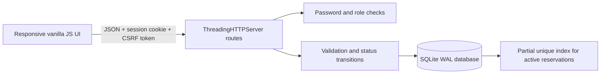

# GLS Gear Desk — Equipment Booking

A polished, dependency-free portfolio project for reserving shared equipment at **GLS University Institute of Technology**. Students see calendar-style availability and reserve a fixed half-day slot; desk staff check equipment out and record returns. The important engineering feature is an atomic, database-enforced guarantee that two requests cannot reserve the same item, date, and slot.

**Python 3.9+ · SQLite · vanilla HTML/CSS/JavaScript · no installation or API key**

This is an unofficial portfolio demo. All people, accounts, inventory, and bookings are synthetic. It is not affiliated with or endorsed by GLS University Institute of Technology.

## Setup from a fresh clone

Prerequisite: **Python 3.9 or newer**. Check with `python3 --version` on macOS/Linux or `py -3 --version` on Windows. The project uses only Python's standard library, so there is no `pip install` step and no API key.

```bash
git clone https://github.com/Siddh-sys-rgb/gls-gear-desk.git
cd gls-gear-desk
```

Creating a virtual environment is optional because the application has no third-party packages. If you prefer an isolated interpreter:

macOS or Linux:

```bash
python3 -m venv .venv
source .venv/bin/activate
```

Windows PowerShell:

```powershell
py -3 -m venv .venv
.venv\Scripts\Activate.ps1
```

Start the application:

```bash
python3 app.py
```

On Windows, `py -3 app.py` is equivalent. Open **http://localhost:8102**. The server binds only to `127.0.0.1`, so it is reachable from this computer rather than exposed to the network.

Confirm the backend is ready in another terminal:

```bash
curl http://127.0.0.1:8102/api/health
```

The expected response is `{"status":"ok","service":"equipment-booking"}`. If `curl` is unavailable, opening that URL in a browser performs the same check.

The sign-in screen displays the demo credentials:

| Role | Email | Password | Useful demo path |
| --- | --- | --- | --- |
| Student | `aarav@gls-demo.invalid` | `Demo123!` | Has a seeded reservation for tomorrow |
| Student | `meera@gls-demo.invalid` | `Demo123!` | Starts with no reservations |
| Administrator | `kavya@gls-demo.invalid` | `Admin123!` | Runs check-out and return workflow |

Passwords and accounts are public fixtures for local demonstration only. Passwords are stored as PBKDF2-SHA256 hashes in SQLite, never as plaintext.

Existing local demo databases from the earlier fixture set are migrated automatically on startup. The known fixture user rows are renamed in place, preserving their primary keys, reservations, and status history; the application does not reset the database during this migration.

Stop the server with **Ctrl+C** in its terminal. Starting `python3 app.py` again reuses the same local database, so reservations survive a normal restart. Sessions are stored only in process memory; a restart signs every user out even though booking data remains.

### Ports, database files, and clean resets

Port 8102 is the default. If the terminal reports that the address is already in use, stop the older process or select another local port:

```bash
python3 app.py --port 9000
```

The default database is `equipment.db` in the repository root. Runtime files such as `equipment.db`, `equipment.db-wal`, `equipment.db-shm`, `equipment.db.server.lock`, virtual environments, caches, and logs are excluded by `.gitignore`; they should never be committed. To use a separate database, pass an explicit local path with `--db`.

To restore the original synthetic users, inventory, and seeded booking, first stop every running Gear Desk server and then run:

```bash
python3 app.py --reset-demo
```

**Warning:** reset permanently discards all reservations and workflow changes in the selected local demo database. The command refuses to run while the corresponding server PID lock is active.

## Two-minute demo script

1. Sign in as Meera and choose tomorrow's date. The dashboard shows three cameras and two projectors, with morning and afternoon availability.
2. Reserve an available item and enter a short purpose. Open **My bookings** to see the confirmed reservation.
3. Cancel it and return to availability; that slot is free again because cancelled rows do not participate in the active reservation constraint.
4. Make another reservation, sign out, and sign in as the administrator.
5. In **Desk workflow**, mark the booking **checked out**, then **returned**. The interface offers only the next legal action.
6. Run the concurrency test described below. Two users race for one slot; the results are exactly one `201 Created` and one `409 Conflict`.

Dates are interpreted by the server's local calendar and stored as ISO `YYYY-MM-DD` values. The interface defaults to tomorrow, making the demo safe even late in the day. Slots are fictional local campus times: morning is 8:00–12:00 and afternoon is 1:00–5:00. The app deliberately models dates and fixed slots rather than cross-time-zone instants.

## Architecture



`app.py` owns the HTTP routes, authentication, business rules, database setup, and local server lifecycle. `static/` contains the accessible responsive interface. Every request opens a short-lived SQLite connection; WAL mode and a five-second busy timeout support the small concurrent workload. `tests/` starts the real threaded server against a temporary database and exercises it through HTTP.

### Data model

| Table | Important columns | Purpose |
| --- | --- | --- |
| `users` | `name`, unique `email`, `password_hash`, `role` | Two students and one administrator |
| `items` | `name`, `category`, `description` | Three cameras and two projectors |
| `bookings` | user/item foreign keys, `booking_date`, `slot`, `purpose`, `status` | Reservation history and workflow state |

Booking status transitions are intentionally small:

```text
reserved ──student cancellation──> cancelled
reserved ──admin check-out───────> checked_out ──admin return──> returned
```

The partial index is the concurrency boundary:

```sql
CREATE UNIQUE INDEX one_active_booking
ON bookings(item_id, booking_date, slot)
WHERE status IN ('reserved', 'checked_out');
```

Booking inserts run inside `BEGIN IMMEDIATE`. Even if two threaded requests both observed availability earlier, SQLite serializes their writes and the unique index rejects the loser. The API converts that constraint violation to `409 Conflict`. Cancellation changes status to `cancelled`, so the row remains as history while its slot becomes reservable.

## API

All request and response bodies are JSON. State-changing authenticated routes require the `X-CSRF-Token` returned by login or `/api/me`.

| Method | Path | Role | Behavior |
| --- | --- | --- | --- |
| `GET` | `/api/health` | Public | Process health for the portfolio launcher |
| `POST` | `/api/login` | Public | Verify credentials and set an HttpOnly session cookie |
| `GET` | `/api/me` | Signed in | Restore the user and CSRF token after reload |
| `POST` | `/api/logout` | Signed in | Delete the in-memory session and expire the cookie |
| `GET` | `/api/items?date=YYYY-MM-DD` | Signed in | Inventory plus availability for both fixed slots |
| `GET` | `/api/bookings` | Signed in | Current user's complete booking history |
| `POST` | `/api/bookings` | Signed in | Validate and atomically reserve a slot |
| `POST` | `/api/bookings/:id/cancel` | Owner | Cancel an owned reservation still in `reserved` state |
| `GET` | `/api/admin/bookings` | Admin | Desk queue across all students |
| `POST` | `/api/admin/:id/checkout` | Admin | Transition `reserved` → `checked_out` |
| `POST` | `/api/admin/:id/return` | Admin | Transition `checked_out` → `returned` |

Validation rejects malformed JSON, bodies over 16 KB, non-integer or out-of-range IDs, unknown items, invalid slots, purposes outside 3–120 characters, past dates, and dates more than 120 days ahead. The UI renders user-controlled values as escaped text.

## Tests

Run the focused suite:

```bash
python3 -m unittest discover -s tests -v
```

The tests create a temporary database and make real HTTP requests. They cover health and login, student/admin authorization, CSRF rejection, date and strict-ID validation, cancellation releasing a slot, the admin state machine, the non-destructive fixture-account migration, and a simultaneous independent-request race where one reservation succeeds and one conflicts. No test modifies `equipment.db`.

The concurrency test is a correctness check, not a throughput benchmark. It uses two authenticated clients synchronized at a barrier and asserts the only valid result set: `[201, 409]`.

GitHub Actions runs this same standalone suite on Python 3.9 and 3.13 for every push and pull request.

## Contributing incrementally

Keep changes small and reviewable: update one behavior, add or adjust the focused regression test, run the complete test command above, and explain the user-visible result in the commit message. Do not add generated databases, SQLite sidecars, PID locks, virtual environments, caches, or logs. A useful first contribution is a waitlist that preserves the existing active-reservation uniqueness rule rather than weakening it.

## Security decisions and limits

- PBKDF2-SHA256 uses a random 16-byte salt and 210,000 iterations; verification uses constant-time comparison.
- Session identifiers and CSRF tokens come from `secrets`. The cookie is `HttpOnly`, `SameSite=Lax`, path-scoped, and expires after eight hours. Sessions remain only in process memory, so restarting signs everyone out.
- Authorization is enforced in backend routes: students can read and cancel only their bookings; administrators alone can access the desk queue and workflow actions.
- Parameterized SQL is used throughout. A 16 KB body limit and strict validation bound the accepted input.
- Local HTTP means the cookie does not use `Secure`. A real deployment must terminate HTTPS and add it, use persistent/revocable sessions, rate-limit login, record audit events, manage secrets, and provide password recovery.
- `ThreadingHTTPServer` is suitable for a local demo, not an internet-facing production server. SQLite is appropriate for this five-item, single-host example; a larger service would use a managed relational database, migrations, observability, and multi-instance-safe session storage.
- The lock file protects the supported reset workflow. It is local process coordination, not a distributed lock.

## Assumptions and honest metrics

- Inventory consists of exactly five individually tracked items: three cameras and two projectors.
- There are exactly two fixed slots per calendar day and reservations may be made from today through 120 days ahead.
- Pickup eligibility, damage inspections, late fees, accessories, approvals, and overlapping arbitrary time ranges are outside this demo's scope.
- Availability is computed for 10 item-slot combinations per selected date. That number is a product fact, not a performance claim.
- Automated coverage proves five scenario groups, including one two-request collision. No load test, accessibility certification, production uptime, or user research was performed.
- The UI is responsive at common phone and desktop widths and uses semantic controls and status messages; keyboard and screen-reader behavior should still receive manual assistive-technology testing before production use.

## Interview talking points

- **Why enforce uniqueness in the database?** A read-then-write check in application code has a race window. The partial unique index makes the invariant true regardless of thread timing.
- **Why keep cancelled and returned rows?** History helps users and operators understand what happened. A partial index separates historical records from occupancy without deleting evidence.
- **Why fixed slots?** They make the product rule legible and the overlap constraint exact. Arbitrary times would need range-overlap semantics and likely PostgreSQL exclusion constraints.
- **Why return `409`?** The request is valid but conflicts with current resource state. The UI can explain the race and refresh availability.
- **What would you build next?** Durable server-side sessions, audit logging, migrations, waitlists, equipment condition reports, notification jobs, timezone-explicit campus configuration, and production database integration.
